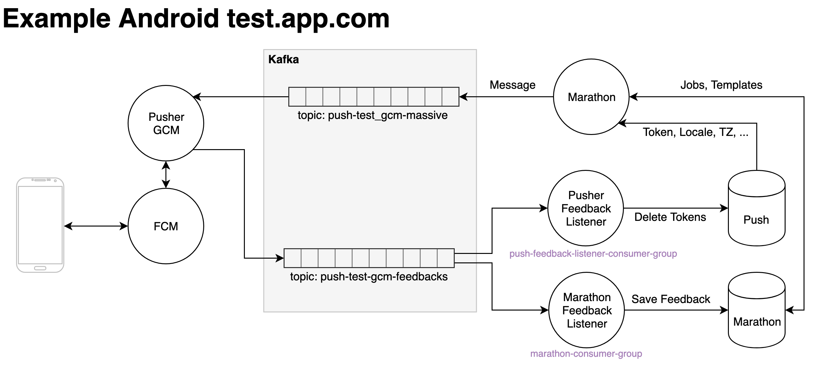

Overview
========

What is Marathon? Marathon is a push notification platform that makes it very easy to send massive push notifications to tens of millions of users for several different apps.

## Features

* **Multi-tenant** - Marathon already works for as many apps as you need, just keep adding new ones;
* **Multi-services** - Marathon supports both gcm and apns services, but plugging a new one shouldn't be difficult;
* **Massive Push Notification** - Send tens of millions of push notifications and keep track of job status;
* **New Relic Support** - Natively support new relic with segments in each API route for easy detection of bottlenecks;
* **Sendgrid Support** - Natively support sendgrid and send emails when jobs are created, scheduled, paused or enter circuit break;
* **Easy to deploy** - Marathon comes with containers already exported to docker hub for every single of our successful builds. Just pick your choice!

## Architecture

Marathon is based on some premises:
- You have a system that reads kafka topics and send pushs to apns and gcms services;
- You have a PostgreSQL Database with user tables containing at least the following information:
  - user_id: the identification of an user, it can be repeated for different tokens (e.g. an user with several devices);
  - token: the device token registered in apns or gcm service;
  - locale: the language of the device (ex: en, fr, pt)
  - region: the region of the device (ex: US, FR, BR)
  - tz: the timezone of the device (ex: -0400, -0300, +0100)
- The apps registered in the Marathon api already have created user tables (in the previous PostgreSQL Database) and Kafka topics for apns and gcm services;

Marathon is composed of three main modules:
  - An API responsible for CRUD of apps, templates and jobs;
  - A worker composed of several sub-workers:
    - A sub-worker responsible for getting the information from the database, building the message and sending to Kafka.
    - A sub-worker responsible for splitting a CSV and creating small devices ID batches.
    - A sub-worker responsible for scheduling push notifiction for users in a CSV file using each user timezone;
    - A sub-worker responsible for building a message given a template and a context and sending it to the app and service corresponding kafka topic;
  - A feedback listener responsible for processing feedbacks of the notifications sent to apns or gcm;

## Marathon and Pusher

Marathon can be used with [Pusher](https://github.com/topfreegames/pusher/). In the following image, you can see a full example of the integration of marathon and pusher. Note that this example doesn't include any routes to send individual messages or to register device tokens (this information must be present the push database, as said in the premises section).

## The Stack

For the devs out there, our code is in Go, but more specifically:

* Web Framework - [Echo](https://github.com/labstack/echo);
* Database - Postgres >= 9.5;
* Workers - [go-workers](https://github.com/jrallison/go-workers) using Redis.
* Kafka and Zookeper;

## Who's Using it

Well, right now, only us at TFG Co, are using it, but it would be great to get a community around the project. Hope to hear from you guys soon!

## How To Contribute?

Just the usual: Fork, Hack, Pull Request. Rinse and Repeat. Also don't forget to include tests and docs (we are very fond of both).
