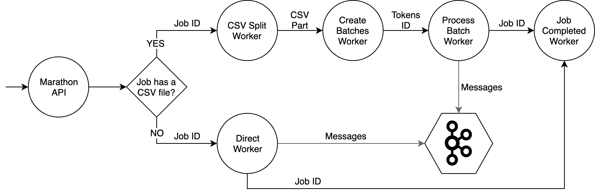

Marathon Workers
================
## Overview

Depending on the job type, different workers can be called. See the image below:

This image shows the workers execution order. Also, you can see each data that go between the workers.

When we have a scheduled job with multiple timezones, multiple jobs will be created and scheduled. Each job will be processed within 1 hour intervals, for example, if a user is at the +1215 timezone he will receive a message when the +1200 is processed.

## Workers 

### Direct Worker

This worker receives from the API batches database intervals to process. It will query the PUSH_DB using the job filters, creates the messages and send to Kafka. This worker is really fast and can handle big amount of tokens (tested with 1.5x10^8 tokens).

If a control group is set, it will be saved on Redis. The completed job worker will pull this data and create a CSV with the control group ids.

It will not generate a CSV of the sent messages.

This worker will produce two metrics:
- `starting_direct_part`: represents when the worker starts;
- `get_from_pg` represent the spent time on retrieving data from the database.

### CSV Split Worker

This worker downloads a CSV file from AWS S3, reads it size and splits it in small batches.
Only one worker will do this job.

After creating each batch, it will send `csv_job_part` metric.

### Create Batches Worker

This worker downloads a part of the CSV file from AWS S3, reads it and creates batches of user information (locale, token, tz). 

### Process Batch Worker

This worker receives a batch of user information (locale and token), builds the template for each user using the locale information and the job template name and send the message to the Kafka topic corresponding to the job app and service. If the error rate is more than a threshold this job enters circuit break state. When the job is paused or in circuit break, the batches are stored in a paused job list in Redis with an expiration of one week.

When this work starts, it sends the `starting_process_batch_worker` metric.

This worker sends messages to Kafka. When the message is delivered, either successfully or with errors, the metric `send_message_return` will be produced.

In some cases IDs can be split between two batches, this worker will notice that and save the split parts in the Redis. After the last batch, this worker will try to join the split parts.

### Job Completed Worker

When all `Process Batch Worker` is completed, it will call this worker. It will send one email saying the job is completed.

Also, it reads the Redis and creates the control group CSV.

### Resume Job Worker

This worker handles jobs that are paused or in circuit break state. It removes a batch from the paused job list and calls the process batch worker for each one of them until are has no more paused batches.
